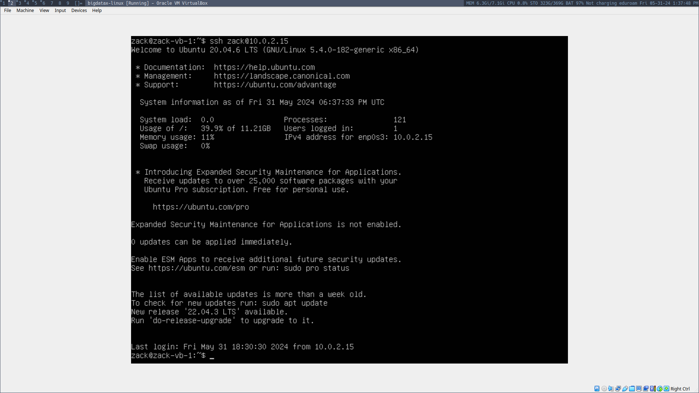

# Linux Assignment

Zack Murry

## I. Virtual Machine Setup

Create an Ubuntu 20.04 server virtual machine in Virtualbox. Configure its username and password.


Allocate 4GB RAM and 2 CPU cores to the VM.


Allow network connections on the virtual machine.


Configure the username and password inside the Linux host.


Configure the firewall to deny all incoming connections besides SSH (port 22) using UFW.


Generate an SSH key and share it to a similar virtual machine.


Connect to the machine using SSH!


## II. Common Linux Commands

### ssh

SSH enables secure shell-based connections between devices.



### ssh-keygen

SSH keygen is a simple interface for creating SSH keys.


### scp

`scp` allows the secure copying of files to a remote host.


### history

The `history` command lists all other commands that have been run in the current terminal session.


### sudo

The `sudo` command allows users to run commands with elevated privileges.


### ip

The `ip` command allows interfacing with the system's network devices.


### dd

The `dd` command provides an interface for copying and deleting files and from disk devices.


### fdisk

The `fdisk` command allows the manipulation of disk partitions.


### apt

The `apt` command provides a uniform interface for managing packages.


### vi

The `vi` command opens an interactive text editor.


### time

The `time` command measures the execution time of a given command.


### tar

The `tar` command allows for compressing and decompressing files and directories.


### cat

The `cat` command conCATenates files to the standard output.


### watch

The `watch` command executes a program at a given interval.


### ps

The `ps` command lists the active processes.


### top

The `top` command displays the resources used by every active process.


### htop

The `htop` command is an alternative to the `top` command with an improved user interface.


### gcc

The GNU C Compiler (`gcc`) is used to compile C programs into executable programs.


### tail

The `tail` command is used to retrive the end of a file or stream.


### grep

The `grep` (global regular expression print) command is used to search files via regular expressions.


### kill

The `kill` command is used to end a process based on its ID.


### killall

The `killall` command is used to end all processes with a given name.


### du

The `du` command is used to view disk usage in a directory.


### df

The `df` command is used to view total and available space on a filesystem.


### screen

The `screen` command is used to concurrently run processes in the background, retrieve them, and kill them.


### vim

The `vim` command is used to view and edit files interactively.


### chmod

The `chmod` command is used to change the access permissions for files or directories.


### chown

The `chown` command is used to change the owner of a file or directory.


### useradd

The `useradd` command is used to add a user account to a system.


### man

The `man` command opens the manual of a given command.


### locate

The `locate` command locates a file or directory in the filesystem by its name.


### find

The `locate` command allows searching for files via their attributes, such as the name, size, or modification date of the files.


### sed

The `sed` command is used for substituting text in a file and outputting the new text to a stream.


### awk

The `awk` command is used to interface with a scripting language that is generally used for editing and filtering text.


### diff

The `diff` command is used to find the difference between files.


### sort

The `sort` command is used to sort data.


### export

The `export` command is used to pass environment variables, functions, and variables to child processes.


### pwd

The `pwd` command is used to Print the Working Directory.


### crontab

The `crontab` command is used to schedule repeated executions of commands.


### mount

The `mount` command is used to mount disks to the filesystem.


### passwd

The `passwd` command is used to change a user's password.


### uname

The `uname` command is used to find information about the machine's operating system and hardware.


### whereis

The `whereis` command is used to locate commands in the filesystem.


### whatis

The `whatis` command displays one-line manual descriptions of commands.


### su

The `su` command is used to change the active user, typically to root.


### ping

The `ping` command is used to check whether a host is reachable by sending it packets.


### traceroute

The `traceroute` command is used to find the path on the network to a host.


### date

The `date` command prints the current date and time.


### time

The `time` command measures the execution time of a given command.


### wget

The `wget` command downloads or uploads files on the network.


### wc

The `wc` (word count) command counts the lines, words, and bytes of files and streams.


### pwgen

The `pwgen` command generates secure passwords that are meant to be easy to memorize.


## III: Bash Scripting

The following bash script creates a data set of size $2 named $3 of integers and strings.

```bash
for i in $(seq 1 $2);
do
  echo $SRANDOM $SRANDOM abcdefghijklmnopqrstuvwxyabcdefghijklmnop
  qrstuvwxyabcdefghijklmnopqrstuvwxyabcdefghijklmnopqrstuvwxy >> $3
done
```

The alphabet string is exactly 100 bytes long in ASCII because the script is encoded in UTF-8, a superset of ASCII. A->Y includes 25 characters, and so alphabet is repeated 3 more times to reach 100 total characters.

Next, we log the performance data of the bash script using the `time` command in the following file format:

```txt
N Create Sort
1000 0.0046 0.008
100000 1.519 0.105
10000000 140.64 13.903
```

The following Python script plots the data given by the `time.txt`.

```python
from matplotlib import pyplot as plt

fig, ax = plt.subplots(figsize=(8, 12))
ax.set_title('Dataset Generation and Sorting Times vs. N')

file = open('time.txt', 'r')

file.readline() # Toss first line

N_data = []
create_data = []
sort_data = []

for i in range(3):
  parts = file.readline().split(' ')
  N_data.append(parts[0])
  create_data.append(parts[1])
  if parts[2][-1] == '\n':
    parts[2] = parts[2][:-1] # Trim newline if present
  sort_data.append(parts[2])

print(f"N: {N_data}, create: {create_data}, sort: {sort_data}")

ax.set_xlabel('N')
ax.set_ylabel('Time (s)')

# Draw lines
ax.plot(N_data, create_data, 'b')
ax.plot(N_data, sort_data, 'r')

# Draw points
for i in range(len(N_data)):
  ax.scatter(N_data[i], create_data[i], color='b')
for i in range(len(N_data)):
  ax.scatter(N_data[i], sort_data[i], color='r')

plt.legend(['Create', 'Sort'])

plt.show()
```

Running the above Python script with the above data yields the following chart:


## IV. Questions about VMs

#### 1. In the system configuration of the VM, explain how changing the number of processors changes the behavior of your VM. Explain a scenario where you want to set this to the minimum, and a scenario where you want to set it to the maximum. Why is setting it to the maximum potentially a bad idea?

- The number of processors influences how quickly the VM can perform operations.
- You may want to set this parameter to the minimum possible value if you intend to create many VMs or need to run other intensive process on your host OS.
- You may want to set this parameter to the maximum if the VM will need to run compute-intensive programs. This is potentially a bad idea because it greatly reduces the amount of processors left for your host OS, which you need to use to manage the virtual machine and perform other tasks.

#### 2. In the system configuration of the VM, under the Acceleration Tab, explain the difference between the paravirtualization options: None, Legacy, Minimal, Hyper-V, and KVM. Explain which one would be best to use with Ubuntu Linux, and why

- None: No paravirtualization is supported, meaning that the guest (VM) OS has no knowledge of the host OS and interfaces with emulated hardware.
- Legacy: Older paravirtualization interfaces are supported, which often lack the performance improvements found with modern paravirtualization techniques.
- Minimal: Some paravirtualization features are suported, granting some performance benefits.
- Hyper-V: Microsoft's Hyper-V hypervisor is supported, which provides good performance, but only for Windows host and guest operating systems.
- KVM: Kernel-based Virtual Machine (KVM) is supported, meaning that the Linux kernel functions as a hypervisor, managing the guest OS. Limitation: the host OS must be Linux-based.
- Verdict: KVM would be best with an Ubuntu host OS because it offers the best performance benefits using a technique that is compatible with the setup.

#### 3. In storage devices when configuring the VM, there are multiple types of storage controllers: explain the difference between the IDE, SATA, and NVMe controller. Give an example for each type of storage controller of a scenario where you may want to use this type of controller.

- IDE: Integrated Drive Electronics is a dated standard for managing storage devices with relatively slow performance and transfer rates of up to 133 MB/s. It handles data transfers using a parallel interface. You may want to use an IDE controller for its compatibility with older systems and software.
- SATA: Serial Advanced Technology Attachment is a more modern standard that uses a serial interface to connect with storage devices. This could be a good option when high transfer speeds are not the most critical priority, and when a balance of speed and compaibility is necessary.
- NVMe: Non-Volatile Memory Express is a standard meant solely for SSDs using the PCI express bus on the motherboard. It offers significantly higher performance than SATA. A potential use case would be an application that requires many high-speed storage calls, like a database server for web applications.

#### 4. In the network configuration of the VM, there are multiple types of network adapters: explain the difference between NAT, Bridged Adapter, Internal Network, and Host-only Network. Give an example for each type of network of a scenario where you may want to use this type of network.

- NAT: Network Address Translation allows the virtual machine to share the host machine's IP address. The VM can access the internet and other networks, but other devices cannot start communication with the VM itself. You may want to use this type of network when creating a VM that requires internet access to run scripts.
- Bridged Adapter: This configuration connects the VM directly to the physical network, behaving like a separate machine on the network and possessing an independent IP address, which can be accessed by other network devices. This could be used to use the VM as a web server for the local network.
- Internal Network: This configuration connects the VMs on an network in which they can communicate wit each other, but they are unable to communicate with the host and any external networks. This could be useful for creating an isolated networking testbed between several VMs.
- Host-only network: This setup is an internal network with a connection to the host machine. This could be useful for running a local web server that requires a Linux-based OS and accessing the website on the host's browser.

#### 5. For the USB configuration of the VM, explain the difference between USB 1.1, 2.0, and 3.0 controllers.

- USB 1.1: This is an older USB standard with a maximum transfer rate of 12 Mbps. This could be useful for using legacy software and hardware with the VM. However, 12 Mbps is a major limitation for many applications.
- USB 2.0: This is a popular standard with a maximum transfer rate of 480 Mbps. This is widely compatible and fast, which makes it a good option for applications that don't require blazing transmission speeds.
- USB 3.0: This is a newer standard with a maximum transfer rate of 5 Gbps, making it very fast. Additionally, it is backwards compatible with USB 2.0 and 1.1 interfaces. This means that USB 3.0 is a great choice for fast and compatible data transmission.
